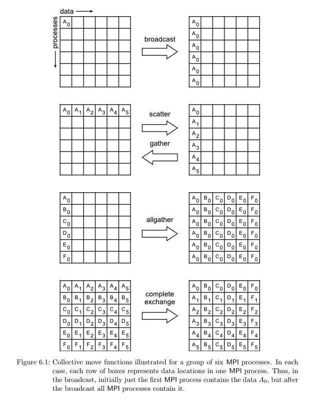

# Message Passing Interface Collective Communication

[MPI Documents](https://www.mpi-forum.org/docs)

## MPI 란?
MPI (Message Passing Interface)는 병렬 컴퓨팅에서 프로세스 간 통신을 위해 사용되는 표준화된 및 가장 널리 사용되는 프로그래밍 모델입니다. 이 표준은 다양한 컴퓨터 아키텍처에서 효율적으로 동작하도록 설계되었으며, 복잡한 데이터 처리 작업을 여러 프로세서에 분산시켜 처리할 수 있게 합니다.

## MPI Collective Communication
MPI 의 collective communication은 병렬 프로그래밍에서 모든 프로세스 간의 데이터 교환을 효율적으로 처리하는 기능입니다. 이러한 통신은 데이터를 공유하거나 프로세스 간에 특정 연산을 수행하기 위해 사용됩니다. collective communication은 모든 참여 프로세스가 통신에 참여해야 완료되며, 각 함수 호출은 모든 프로세스에서 동시에 이루어져야 합니다.

### Communicator
MPI에서는 두 가지 유형의 커뮤니케이터를 사용합니다:

#### Intra Communicators
* 같은 그룹 내의 프로세스들 사이의 통신을 위해 사용됩니다.
* 단일 그룹 내에서 데이터를 공유하거나 작업을 조정할 때 사용합니다.
* 예: MPI_COMM_WORLD는 모든 MPI 프로세스를 포함하는 기본 커뮤니케이터입니다.

#### Inter Communicators
* 서로 다른 두 그룹 간의 통신을 위해 사용됩니다.
* 다른 그룹의 프로세스와 데이터를 교환할 필요가 있을 때 사용합니다.
* 두 개의 별도 MPI 프로세스 그룹이 서로 다른 데이터 세트를 처리하고 결과를 교환해야 할 경우 사용됩니다.

#### Rank
* 각 프로세스는 커뮤니케이터 내에서 유일한 rank를 갖습니다. 
* 예를 들어, MPI_COMM_WORLD에서 프로세스의 rank는 0부터 시작하여 MPI 프로그램 내의 프로세스 수 - 1까지 할당됩니다.
* Rank는 보통 프로세스가 시작된 순서대로 할당됩니다. 이 순서는 프로그램 실행 시 프로세스를 구동하는 데 사용되는 시스템의 스케줄링과 할당 정책에 따라 달라질 수 있습니다.
* Rank는 MPI 통신 함수에서 송신자와 수신자를 지정하는 데 사용됩니다. 예를 들어, MPI_Send 함수를 사용할 때, 데이터를 받을 프로세스의 rank를 명시해야 합니다.
* Rank 활용
  * 데이터 분할: 대규모 데이터 세트를 여러 프로세스에 분할하여 각 프로세스가 데이터의 일부를 처리하도록 할 때, 각 프로세스의 rank를 기준으로 데이터를 할당할 수 있습니다.
  * 조건부 실행: 특정 연산이나 함수 호출이 특정 rank의 프로세스에 의해서만 수행되도록 프로그래밍할 수 있습니다. 예를 들어, rank 0의 프로세스만 결과를 수집하고 출력하는 역할을 할 수 있습니다.
  * 동적 통신 패턴: 프로그램의 실행 중에 특정 패턴이나 알고리즘에 따라 프로세스 간의 통신 경로를 조정할 때 rank를 사용하여 동적으로 송수신자를 변경할 수 있습니다.

## Collective Communication Operations

### MPI_Barrier
MPI_Barrier는 모든 참여 프로세스가 특정 지점에 도달할 때까지 기다리는 동기화 메커니즘을 제공합니다. 이 함수는 모든 프로세스가 동기화 지점에 도착할 때까지 어떤 프로세스도 넘어갈 수 없도록 하여, 모든 프로세스가 동일한 시점에 작업을 계속하도록 보장합니다.

#### 동작
1. 각 프로세스는 MPI_Barrier 함수 호출에 참여함으로써 동기화 지점에 도달했음을 나타냅니다.
2. 모든 프로세스가 MPI_Barrier 호출을 완료할 때까지 각 프로세스는 대기 상태에 머무릅니다.
3. 모든 프로세스가 동기화 지점에 도달하면, 모든 프로세스는 동시에 다음 작업으로 진행할 수 있습니다.

#### 사용 
* 동기화
  * 병렬 프로그램에서 계산의 여러 단계 사이에 모든 프로세스가 동일한 상태에 있도록 보장할 때 사용합니다. 예를 들어, 중간 결과를 계산한 후 모든 프로세스가 결과를 공유하기 전에 동기화가 필요할 수 있습니다.
* 테스트 및 디버깅
  * 복잡한 병렬 애플리케이션에서 특정 단계에서 모든 프로세스의 상태를 확인하고자 할 때 유용합니다. 모든 프로세스가 동일한 지점에서 멈추도록 하여 시스템의 상태를 분석할 수 있습니다.

#### 예제 
* [MPI_Barrier](../barrier.c)

### MPI_Bcast
Broadcast 연산은 한 프로세스(통상적으로 루트 프로세스라고 부름)에서 모든 다른 프로세스로 데이터를 전송하는 과정입니다. 이 연산은 모든 참여 프로세스가 동일한 데이터를 갖게 되어야 할 때 사용되며, 설정 정보, 초기 값, 공통 변수 등을 공유하는데 유용합니다.

#### 동작
1. 루트 프로세스가 전송할 데이터를 지정합니다.
2. 루트 프로세스에서 시작된 데이터가 커뮤니케이터에 속한 모든 다른 프로세스로 복사됩니다.
3. 모든 프로세스가 데이터를 수신하였는지 확인하고, 다음 계산 단계로 넘어갈 수 있도록 합니다.

#### 사용
* 파라미터 공유
  * 분산 시스템에서 모든 노드가 알고리즘 수행을 시작하기 전에 필요한 파라미터를 공유할 때 Broadcast를 사용합니다.
* 초기 설정
  * 시뮬레이션 또는 병렬 처리 작업을 시작하기 전에 필요한 초기 설정 값을 모든 프로세스에 배포할 때 사용합니다.
* 공통 데이터 업데이트
  * 모든 프로세스가 참조해야 하는 공통 데이터가 업데이트되었을 때, 이를 모든 프로세스와 동기화하기 위해 Broadcast를 활용합니다.

#### 예제 
* [MPI_Bcast](../broadcast.c)

### MPI_Gather 
Gather 연산은 모든 프로세스에서 데이터를 수집하여 단일 프로세스(루트 프로세스)에 집중시키는 과정입니다. 이 연산은 여러 프로세스에서 처리된 결과를 하나의 프로세스에서 분석하거나, 집계하는 데 사용됩니다.

#### 동작
1. 각 프로세스는 자신의 로컬 데이터를 제공합니다.
2. 루트 프로세스는 모든 프로세스로부터 데이터를 수집하고, 이를 하나의 데이터 세트로 결합합니다.
3. 최종적으로 모든 데이터는 루트 프로세스에 위치하게 됩니다.

#### 사용
* 결과 집계
  * 분산 처리에서 각 노드의 계산 결과를 하나의 노드에서 수집하여 최종 결과를 도출할 때 사용합니다.
* 데이터 분석
  * 여러 위치에서 수집된 데이터를 중앙 위치에서 분석하기 위해 사용합니다.
* 성능 모니터링
  * 각 노드에서 모니터링된 성능 지표를 중앙 서버에서 분석하기 위해 사용합니다.

#### 예제 
* [MPI_Gather](../gather.c)

### MPI_Scatter
하나의 프로세스에서 시작하여 여러 프로세스에 데이터를 분배하는 과정입니다. 이 연산은 큰 데이터 세트를 여러 프로세스에 분할하여 병렬 처리를 용이하게 합니다.

#### 동작
1. 루트 프로세스가 분배할 전체 데이터를 보유합니다.
2. 루트 프로세스는 데이터의 일부를 각 프로세스에 할당합니다.
3. 데이터가 각 프로세스에 성공적으로 전달되었는지 확인합니다.

#### 사용
* 작업 할당
  * 대규모 데이터 세트를 여러 노드에 분산하여 각 노드가 서로 다른 부분을 동시에 처리할 수 있도록 합니다.
  * 리소스 분배: 초기 리소스 또는 작업을 각 프로세스에 공평하게 분배할 때 사용합니다.
  * 병렬 데이터 처리: 큰 이미지나 파일을 여러 부분으로 나누어 각 프로세스가 하나의 부분을 처리하도록 합니다.

#### 예제 
* [MPI_Scatter](../scatter.c)

### MPI_Reduce
모든 참여 프로세스로부터 데이터를 수집하고, 지정된 연산(예: 합, 최대, 최소, 논리적 AND/OR 등)을 적용한 후, 그 결과를 루트 프로세스에게만 제공합니다. 이 연산은 데이터 집계 작업에 사용되며, 통합된 결과는 루트 프로세스에서만 사용 가능합니다.

#### 동작
1. 각 프로세스는 자신의 로컬 데이터를 입력으로 제공합니다.
2. 지정된 연산이 모든 프로세스의 입력 데이터에 대해 수행됩니다.
3. 연산의 결과가 루트 프로세스에게만 반환됩니다.

#### 사용
* 데이터 집계
  * 여러 프로세스에서 생성된 데이터를 합산하여 대규모 계산의 최종 결과를 도출할 때 사용됩니다.
* 결과 보고
  * 분산 애플리케이션에서 중요한 결정 정보를 루트 프로세스에서 집계하여 보고서를 생성할 때 사용합니다.

#### 예제 
* [MPI_Reduce](../reduce.c)

### MPI_Allgather
모든 참여하는 프로세스가 각각의 데이터를 모든 다른 프로세스와 공유할 때 사용됩니다. 이 연산은 모든 프로세스가 서로의 데이터를 수집하고 싶을 때 매우 유용하며, 각 프로세스가 생성한 데이터를 전체적으로 조합하고자 할 때 필요합니다.

#### 동작
1. 각 프로세스는 자신의 로컬 데이터를 제공하고, 다른 모든 프로세스의 데이터를 받습니다.
2. 연산이 끝나면, 각 프로세스는 모든 프로세스의 데이터를 포함하는 배열을 갖게 됩니다. 이 배열의 순서는 프로세스의 랭크 순서에 따라 결정됩니다.

#### 사용 
* 데이터 동기화
  * 모든 노드가 전체 데이터 세트에 대한 최신 정보를 유지할 필요가 있을 때 사용합니다.
* 결과 공유
  * 각 노드의 중간 계산 결과를 모든 노드가 알아야 할 때 사용합니다.

#### 예제 
* [MPI_Allgather](../allgather.c)

### MPI_Allreduce
모든 참여 프로세스가 제공한 데이터를 결합한 후, 그 결과를 다시 모든 프로세스에게 배포합니다. 이 연산은 주로 데이터 집계 작업에 사용되며, 각 프로세스의 입력 데이터에 특정 연산(예: 합, 최대, 최소, 논리적 AND/OR 등)을 적용한 결과를 모든 프로세스에게 제공합니다.

#### 동작
1. 각 프로세스는 자신의 로컬 데이터를 입력으로 제공합니다.
2. 지정된 연산(예: 합계, 최대값, 논리 연산 등)이 모든 프로세스의 입력 데이터에 대해 수행됩니다.
3. 연산의 결과가 모든 프로세스에게 동일하게 반환됩니다. 이 결과는 각 프로세스가 동일한 최종 값을 받는 것을 보장합니다.

#### 사용 
* 통계 계산
  * 여러 프로세스가 서로 다른 데이터 세트에서 계산을 수행하고, 전체 데이터 세트에 대한 통계(예: 평균, 합계, 최대값)를 구해야 할 때 Allreduce를 사용할 수 있습니다.
* 동기화
  * 병렬 시뮬레이션에서 모든 프로세스가 동일한 시점에서 계산을 수행해야 하는 경우, Allreduce를 사용하여 각 단계의 완료 여부를 확인하고 다음 단계로 진행할 수 있습니다.
* 자원 관리
  * 분산 시스템에서 자원 사용량(예: 메모리 사용량, CPU 시간)을 모니터링하고, 전체 자원 사용량에 따라 작업을 조정할 때 유용합니다.

#### 예제 
* [MPI_Allreduce](../allreduce.c)

### MPI_Alltoall
각 프로세스로부터 데이터를 수집하고, 모든 프로세스에게 이 데이터를 균등하게 분배합니다. 이 연산은 프로세스 간 데이터의 완전한 재분배에 사용되며, 모든 프로세스는 모든 다른 프로세스로부터 데이터를 받습니다.

#### 동작
1. 각 프로세스는 분배할 데이터의 일부를 입력으로 제공합니다.
2. 모든 프로세스는 모든 다른 프로세스에게 데이터를 보내고, 동시에 데이터를 수신합니다.
3. 각 프로세스는 전체 네트워크로부터 데이터의 일부를 받습니다.

#### 사용 
* 데이터 리밸런싱
  * 병렬 데이터 처리에서 데이터를 균등하게 분배하여 로드 밸런싱을 최적화할 때 사용합니다.
* 복잡한 통신 패턴 시뮬레이션
  * 네트워크 통신 패턴을 시뮬레이션하거나 테스트할 때 사용합니다.

#### 예제 
* [MPI_Alltoall](../alltoall.c)

### MPI_Reduce_scatter
모든 참여 프로세스로부터 데이터를 수집하고, 지정된 연산을 적용한 후, 그 결과를 각 프로세스에 지정된 크기만큼 분배합니다. 이 연산은 데이터 집계와 분배를 동시에 수행하며, 각 프로세스는 연산 결과의 일부를 받습니다.

#### 동작 
1. 각 프로세스는 자신의 로컬 데이터를 입력으로 제공합니다.
2. 지정된 연산이 전체 입력 데이터에 대해 수행됩니다.
3. 연산 결과는 각 프로세스의 요구에 맞게 분할되어 반환됩니다.

#### 사용
* 효율적인 집계 및 분배
  * 대규모 병렬 시스템에서 결과를 집계하고 효율적으로 데이터를 각 프로세스에 분배할 때 사용됩니다.
* 부분 집계 처리
  * 각 프로세스가 전체 집계 결과의 일부만 필요로 할 때 사용합니다.

#### 예제 
* [MPI_Reduce_scatter](../reduce_scatter.c)
  * 각 프로세스로 분배되는 데이터 크기가 가변
* [MPI_Reduce_scatter_block](../reduce_scatter_block.c)
  * 고정된 크기로 데이터 분배

### MPI_SCAN
모든 참여 프로세스로부터 데이터를 수집하고, 지정된 연산을 순차적으로 적용하여 각 프로세스에 누적 결과를 제공합니다. 이 연산은 프로세스 배열에서 누적 연산의 중간 결과를 각 단계에서 필요로 할 때 사용됩니다.

#### 동작
1. 각 프로세스는 자신의 데이터를 입력으로 제공합니다.
2. 입력 데이터에 대해 누적 연산이 수행되며, 각 프로세스는 이전 프로세스까지의 누적 결과를 받습니다.
3. 각 프로세스는 자신의 순위까지의 누적 결과를 받습니다.

#### 사용
* 누적 통계 계산
  * 데이터 스트림을 처리하며, 각 단계에서의 누적 결과가 필요할 때 사용됩니다.
* 동적 의사결정 지원
  * 계산 과정에서 누적 데이터를 기반으로 중간 단계에서 의사결정을 지원할 때 사용합니다.

#### 예제 
* [MPI_Scan](../scan.c)